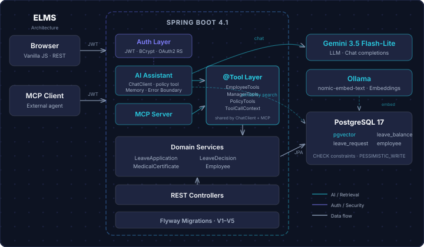
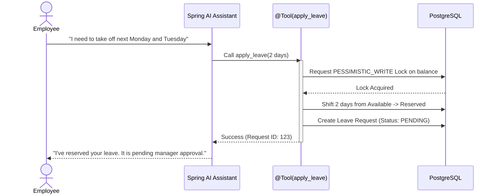
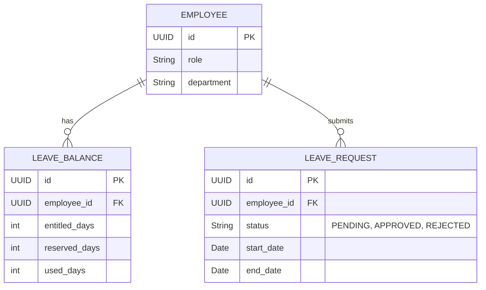

# Employee Leave Management System (ELMS)

An intelligent Employee Leave Management System that combines a traditional Spring Boot backend with an AI-powered conversational interface. Employees can check balances, ask policy questions, and apply for leave using natural language.

## ✨ Key Features

* **Conversational AI Interface:** Apply for leave and manage requests seamlessly through an AI chat assistant instead of complex forms.
* **Policy Q&A (RAG):** Ask questions about company leave policies and get accurate answers grounded in internal documents via `pgvector`.
* **Manager Workflows:** Dedicated routes for managers to review, approve, or reject pending leave requests.
* **Transaction Safety:** Strict database locking ensures leave balances are accurately tracked and never double-spent.
* **MCP Integration:** Exposes internal system tools via the Model Context Protocol (MCP), allowing external agents (like Claude Desktop) to interact with the system securely.

## 🛠️ Tech Stack

* **Backend:** Java 21, Spring Boot, Spring Security (JWT)
* **AI & Data:** Spring AI, Gemini API, Ollama (Embeddings), PostgreSQL 17 + `pgvector`
* **Frontend:** Vanilla HTML, JavaScript, CSS

## 🏗️ System Architecture

The system is designed with a unified tool execution boundary. Both internal web clients and external MCP agents interact with the exact same domain logic, with identity securely enforced via server-side JWTs rather than LLM arguments.

<p align="center">
  
</p>

## 📊 Core Workflows & Data (UML)

### Leave Application Sequence
This sequence demonstrates the pessimistic locking mechanism used to safely transition leave balances and prevent "double-spending" during concurrent AI requests.



### Database Schema (ERD)


## 🚀 Getting Started

### Prerequisites
* Java 21+
* Docker (for PostgreSQL)
* Ollama (running locally with `nomic-embed-text` installed: `ollama run nomic-embed-text`)
* Gemini API Key

### 1. Database Setup
Navigate to the backend directory and start the database container:
```bash
cd ELMS-Backend
docker compose up -d
```

### 2. Configuration
Create an `.env` file in the `ELMS-Backend` directory with your secrets:
```env
API_KEY=your_gemini_api_key_here
JWT_SECRET=your_jwt_secret_here
```

### 3. Run the Backend
Start the Spring Boot application using the Maven wrapper:
```bash
./mvnw spring-boot:run
```

### 4. Run the Frontend
Open a new terminal, navigate to the frontend directory, and serve it using any local web server (e.g., `npx serve` or Python's `http.server`):
```bash
cd ../ELMS-Frontend
npx serve .
```
Once running, open the provided `localhost` URL in your browser to access the dashboard.

## 📁 Project Structure

* `/ELMS-Backend` - Spring Boot application, domain logic, and REST/MCP endpoints.
* `/ELMS-Frontend` - Web client dashboard and chat UI.
* `/presentation-deck` - Technical overview presentation of the system's architecture.
