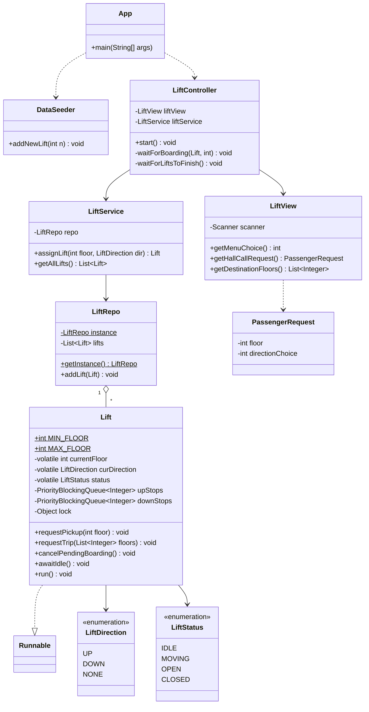

# 🛗 Lift Management System — Multithreaded Elevator Simulator

A multithreaded elevator simulation system built in **plain Java** as a Low-Level Design (LLD) project.

The system simulates multiple elevators operating independently in real time. Each active elevator runs on its own worker thread and handles passenger requests using a realistic **2-Phase Call Flow (Hall Call → Boarding → Car Call)**, mimicking physical elevator mechanics.

---

## ⚡ Highlights & Technical Key Points

- **One Thread per Active Elevator**: Each lift operates on an isolated background thread (`Thread`, `Runnable`) without cross-elevator lock contention.
- **Realistic 2-Phase Call Mechanics**: Decouples passenger floor pickup requests (Hall Call) from elevator destination selections (Car Call).
- **SCAN Algorithm with Dual Min/Max Heaps**: Elevator continues moving in its current direction serving requested stops via `PriorityBlockingQueue` (min-heap for UP stops, max-heap for DOWN stops).
- **Zero Busy-Waiting**: Elevators pause during passenger boarding using intrinsic monitor synchronization (`wait()` / `notifyAll()`) rather than CPU-intensive polling loops.
- **Dynamic Queue Re-bucketing**: Automatically shifts stale stops to the opposing queue if an elevator passes a target floor before servicing it.
- **Zero External Dependencies**: Standard Java 11+ concurrency primitives (`java.util.concurrent`, `volatile`, monitor locks).

---

## 🏗️ Architecture & Class Diagram



### 📁 Package Structure

```text
Lift Management/
├── presentation-deck/          # Interactive Technical Presentation Deck (HTML/CSS/JS)
│   ├── index.html
│   ├── deck.css
│   └── deck.js
└── src/
    ├── App.java
    ├── DataSeeder.java
    └── com/akshaya/liftmanagement/
        ├── Lift.java           # Elevator domain model & Runnable worker thread
        ├── LiftController.java # Controls user request lifecycle & boarding flow
        ├── LiftService.java    # Dynamic elevator assignment & nearest-lift heuristics
        ├── LiftRepo.java       # Thread-safe repository storing active elevators
        ├── LiftView.java       # Console input interface & menu prompts
        ├── PassengerRequest.java# Hall-call data record (floor + direction)
        ├── LiftDirection.java  # Direction Enum (UP, DOWN, NONE)
        ├── LiftStatus.java     # State Enum (IDLE, MOVING, OPEN, CLOSED)
        └── util/
            └── ConsoleScanner.java # Shared scanner utility
```

---

## 🔄 How a Request Works (2-Phase Flow)

```
[Passenger at Floor X] ---> 1. Hall Call (Floor X + UP/DOWN Direction)
                                 │
                                 ▼
                    LiftService assigns nearest Lift
                                 │
                                 ▼
                    Lift travels to Floor X
                                 │
                                 ▼
               Doors OPEN & Lift thread pauses on wait()
                                 │
                                 ▼
[Passenger inside Lift] --> 2. Car Call (Destination Floor(s))
                                 │
                                 ▼
                 notifyAll() wakes Lift worker thread
                                 │
                                 ▼
               Lift services stops via SCAN Algorithm
```

---

## 🚀 Building and Running

### Prerequisites
- **Java 11+** installed

### Compile & Run via CLI
```bash
# Compile
javac -d bin $(find src -name "*.java")

# Execute
java -cp bin App
```

---

## 🛠️ Tech Stack & Skills Demonstrated

- **Language**: Java 11+ (Plain Java)
- **Concurrency & Multithreading**: `java.util.concurrent`, `PriorityBlockingQueue`, `Runnable`, `Thread`, `volatile`
- **Synchronization**: Intrinsic monitor locks (`synchronized`), condition notifications (`wait()` / `notifyAll()`)
- **Software Patterns**: Singleton (`LiftRepo`), Strategy / Dispatcher (`LiftService`), Layered MVC Architecture

---

## 📝 License
This project is open source and available under the [MIT License](LICENSE).
